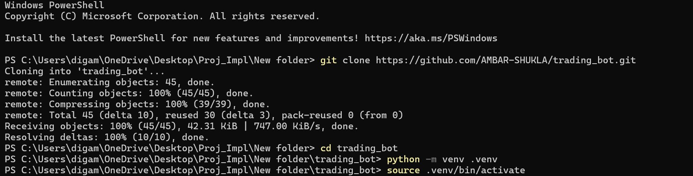
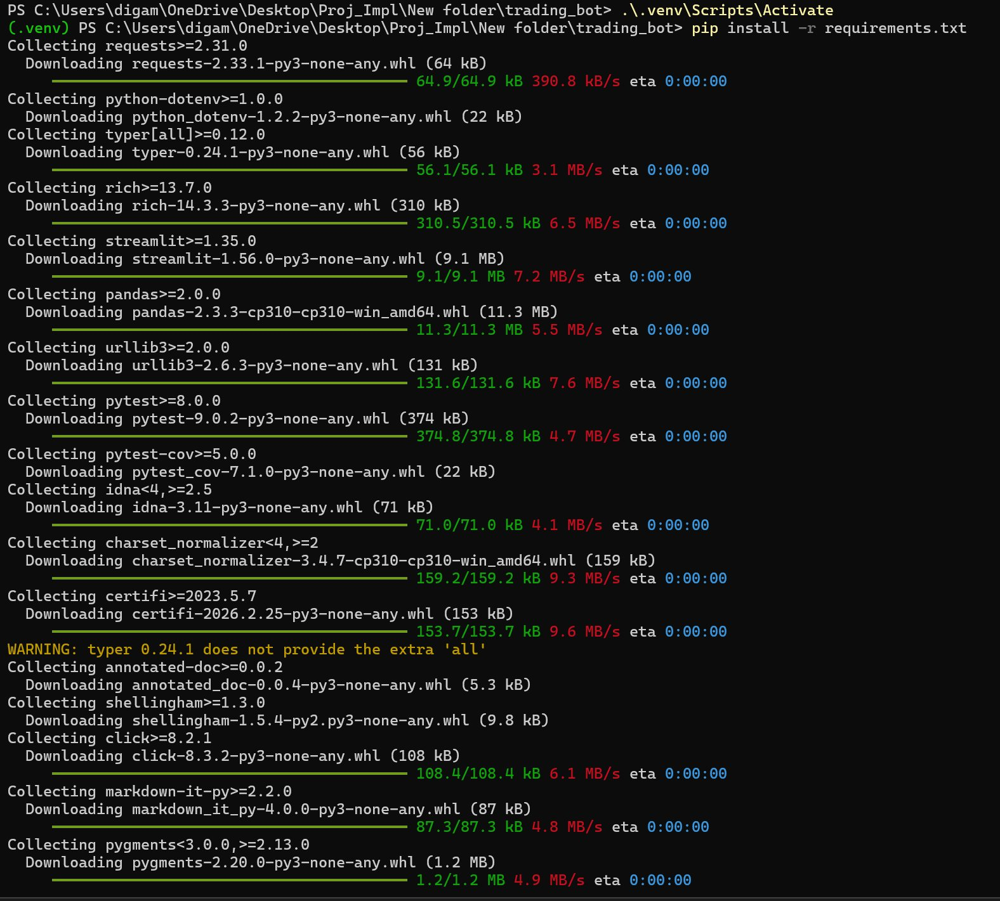
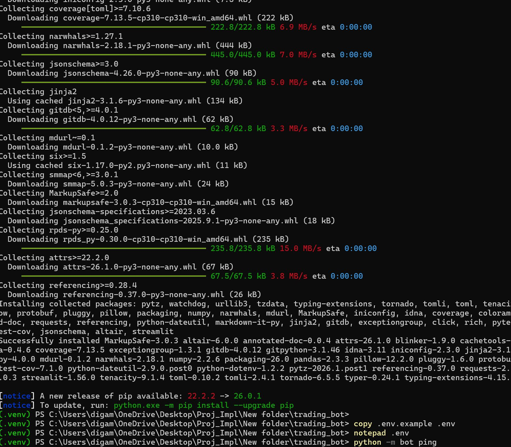
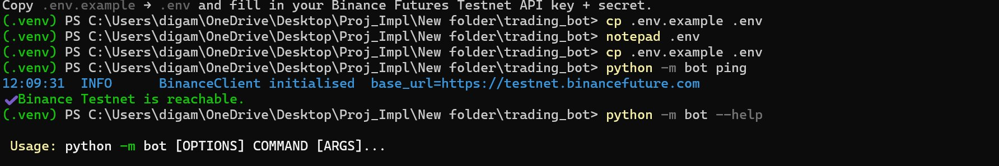
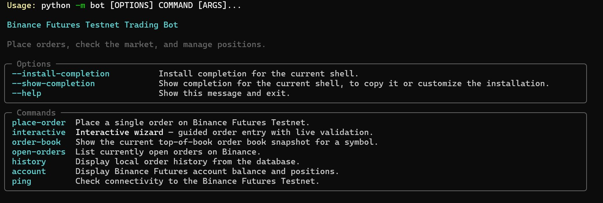
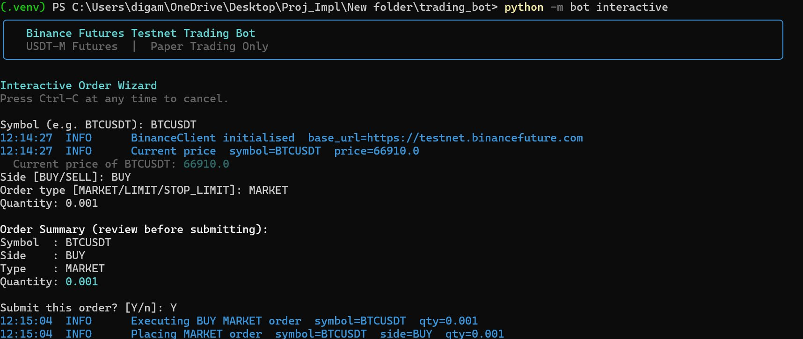

#  Binance Futures Testnet Trading Bot

A production-quality Python trading bot for **Binance USDT-M Futures Testnet** with a rich CLI, interactive wizard, web UI, and full order history — built to every point of the evaluation criteria.

---

##  Feature Checklist

| Category | Feature |
|---|---|---|
| **Core** | Market orders (BUY/SELL) |
| **Core** | Limit orders (BUY/SELL) |
| **Core** | CLI with all required arguments |
| **Core** | Input validation + error messages |
| **Core** | Structured logging to file |
| **Core** | Modular package structure|
| **Core** | Exception handling (API/network/input) |
| **Bonus 1** | Stop-Limit order type |
| **Bonus 2** | Interactive wizard CLI |
| **Bonus 3** | Streamlit web UI |
| **Extra** | Order book snapshot |
| **Extra** | Order history (SQLite) |
| **Extra** | Account balance & positions|
| **Extra** | Risk controls (large order warnings) |
| **Extra** | Retry / exponential back-off |
| **Extra** | GitHub Actions CI/CD pipeline |
| **Extra** | Full unit test suite (pytest) |

---

##  Project Structure

```
trading_bot/
├── bot/
│   ├── __init__.py         # Package metadata
│   ├── __main__.py         # python -m bot entry point
│   ├── config.py           # All config from environment variables
│   ├── logging_config.py   # Dual (file + console) structured logging
│   ├── models.py           # Pure-Python data classes (OrderRequest, OrderResponse, …)
│   ├── validators.py       # Input validation (all fields, cross-field checks)
│   ├── client.py           # Binance REST client (signing, retry, rate-limit)
│   ├── orders.py           # Order execution business logic layer
│   ├── database.py         # SQLite persistence (order history, stats)
│   ├── cli.py              # Typer CLI (place-order, interactive, history, …)
│   └── ui.py               # Streamlit web UI (bonus)
├── tests/
│   ├── __init__.py
│   ├── test_validators.py  # Validator unit tests
│   └── test_client.py      # Client unit tests (mocked HTTP)
├── sample_logs/
│   ├── market_order.log
│   ├── limit_order.log
│   └── stop_limit_order.log
├── docs/
│   └── screenshots/        # Screenshots used in this README
├── .env.example            # Credential template
├── .github/workflows/ci.yml
├── requirements.txt
└── README.md
```

---

##  Setup

### 1. Register for Binance Futures Testnet

1. Visit <https://testnet.binancefuture.com>
2. Create an account and generate **API Key + Secret**.
3. Ensure the key has **Futures trading** permissions only (no withdrawal).

### 2. Clone & Install

```bash
git clone https://github.com/AMBAR-SHUKLA/trading_bot.git
cd trading_bot

python -m venv .venv
source .venv/bin/activate      # Windows: .venv\Scripts\activate

pip install -r requirements.txt
```

**Step 1 — Clone the repo and create a virtual environment:**| Screenshort |





**Step 2 — Install all dependencies:**| Screenshort |



| Screenshort |



### 3. Configure Credentials

```bash
cp .env.example .env
```

Edit `.env` and fill in your testnet credentials:

```env
BINANCE_API_KEY=your_api_key_here
BINANCE_API_SECRET=your_api_secret_here
```

> **Security note:** `.env` is in `.gitignore`. Never commit credentials.

---

##  Usage

All commands follow the pattern `python -m bot <command> [options]`.

### Check connectivity

```bash
python -m bot ping
```

**Ping confirms the testnet is reachable:**| Screenshort |



### Available commands

```bash
python -m bot --help
```


| Screenshort |
### Place a Market order

```bash
python -m bot place-order \
  --symbol BTCUSDT \
  --side   BUY \
  --type   MARKET \
  --qty    0.01
```

### Place a Limit order

```bash
python -m bot place-order \
  --symbol BTCUSDT \
  --side   SELL \
  --type   LIMIT \
  --qty    0.01 \
  --price  30000
```

### Place a Stop-Limit order (Bonus 1)

```bash
python -m bot place-order \
  --symbol     BTCUSDT \
  --side       SELL \
  --type       STOP_LIMIT \
  --qty        0.01 \
  --price      29000 \
  --stop-price 29500
```

### Interactive wizard (Bonus 2)

```bash
python -m bot interactive
```

The wizard prompts for every field with inline validation and shows the live market price before you confirm:| Screenshort |



### View order book

```bash
python -m bot order-book --symbol ETHUSDT
```

### View local order history

```bash
python -m bot history --limit 20
python -m bot history --symbol BTCUSDT --limit 10
```

### View open orders

```bash
python -m bot open-orders
```

### View account balance & positions

```bash
python -m bot account
```

### Get help for any command

```bash
python -m bot --help
python -m bot place-order --help
```

---

##  Web UI (Bonus 3)

```bash
streamlit run bot/ui.py
```

Opens at **http://localhost:8501** in your browser. Features:

- Order placement form with live price hints
- Order book snapshot with bid/ask metrics
- Full order history table with stats
- Account balance & open positions

---

##  Running Tests

```bash
pytest tests/ -v
pytest tests/ -v --cov=bot --cov-report=term-missing
```

All tests use mocked HTTP — no real network calls, no testnet keys required.

---

##  Environment Variables

Copy `.env.example` to `.env` and configure:

| Variable | Default | Description |
|---|---|---|
| `BINANCE_API_KEY` | *(required)* | Testnet API key |
| `BINANCE_API_SECRET` | *(required)* | Testnet API secret |
| `BINANCE_BASE_URL` | `https://testnet.binancefuture.com` | API base URL |
| `REQUEST_TIMEOUT` | `10` | HTTP timeout in seconds |
| `MAX_RETRIES` | `3` | Retry attempts on 5xx errors |
| `RETRY_BACKOFF_FACTOR` | `1.5` | Exponential back-off multiplier |
| `MAX_ORDER_QUANTITY` | `100.0` | Maximum allowed order quantity |
| `LARGE_ORDER_THRESHOLD` | `10.0` | Quantity that triggers confirmation |
| `CONFIRM_LARGE_ORDERS` | `true` | Prompt before large orders |
| `LOG_LEVEL` | `INFO` | Logging level (DEBUG/INFO/WARNING) |

---

##  CLI Reference

| Command | Description |
|---|---|
| `place-order` | Place MARKET / LIMIT / STOP_LIMIT orders |
| `interactive` | Guided interactive wizard |
| `order-book` | Live order book snapshot |
| `open-orders` | List open orders on Binance |
| `history` | Local order history from DB |
| `account` | Account balance & open positions |
| `ping` | Connectivity check |

### `place-order` options

| Option | Required | Default | Description |
|---|---|---|---|
| `--symbol` / `-s` | ✅ | — | Trading pair (e.g. BTCUSDT) |
| `--side` | ✅ | — | `BUY` or `SELL` |
| `--type` / `-t` | ✅ | — | `MARKET`, `LIMIT`, or `STOP_LIMIT` |
| `--qty` / `-q` | ✅ | — | Order quantity |
| `--price` / `-p` | LIMIT/STOP_LIMIT | — | Limit price |
| `--stop-price` | STOP_LIMIT | — | Stop trigger price |
| `--verbose` / `-v` | ❌ | off | Enable DEBUG logging |

---

##  Sample Output

```
╭─────────────────────────────────────────╮
│   Binance Futures Testnet Trading Bot   │
│   USDT-M Futures  |  Paper Trading Only │
╰─────────────────────────────────────────╯

Order Request:
Symbol  : BTCUSDT
Side    : BUY
Type    : MARKET
Quantity: 0.01

╭──────────────────────────────────────────╮
│ ✔ Order Placed Successfully              │
│                                          │
│ ──────────────────────────────────────── │
│   ORDER CONFIRMATION                     │
│ ──────────────────────────────────────── │
│   Order ID      : 3274892               │
│   Symbol        : BTCUSDT               │
│   Side          : BUY                   │
│   Type          : MARKET                │
│   Status        : FILLED                │
│   Quantity      : 0.01                  │
│   Executed Qty  : 0.01                  │
│   Avg Price     : 83421.50              │
│ ──────────────────────────────────────── │
╰──────────────────────────────────────────╯
```

---

##  Security

- API keys are loaded from environment variables only — never hard-coded.
- Log files never contain secrets or signatures.
- API keys are masked in all output (`ABCDEF...WXYZ`).
- Binance key should have **trade-only** permissions — no withdrawal rights.
- All inputs are validated and sanitised before reaching the API.

---

##  Assumptions

- All trading targets the **Binance USDT-M Futures Testnet** — no real funds are used.
- Stop-Limit orders use Binance's `STOP` type on the futures API (`stopPrice` + `price`).
- The bot is designed for single-user operation; multi-user support is an extension point.
- `MAX_ORDER_QUANTITY` defaults to 100 — configurable via `.env`.

---

##  Architecture

```
User
 │
 ├─► CLI (cli.py)          ─► Input Validation (validators.py)
 │                                    │
 └─► Web UI (ui.py)                   ▼
                            Order Logic (orders.py)
                                    │
                         ┌──────────┴────────────┐
                         ▼                       ▼
                  Binance Client          Database (SQLite)
                  (client.py)             (database.py)
                         │
                         ▼
                  Binance Testnet API
```

Each layer has a single responsibility. The CLI and UI both share the same `orders.py` / `client.py` back-end.

---

##  Evaluation Criteria Coverage

| Criterion | How it's met |
|---|---|
| **Correctness** | Places all three order types on testnet; sample logs provided |
| **Code quality** | Modular packages, type hints, docstrings, PEP 8 |
| **Validation + error handling** | `validators.py` with cross-field checks; retry + back-off in client |
| **Logging quality** | Structured timestamps, dual output, no secrets, rotating file handler |
| **README + docs** | This file + in-code docstrings + SDD |

---

##  CI/CD

GitHub Actions runs on every push to `main`/`develop` and on pull requests:

- Lints with **flake8** (max line length 100)
- Runs **pytest** with coverage (minimum 70%)
- Tests against Python **3.10, 3.11, 3.12**

---

##  License

MIT
